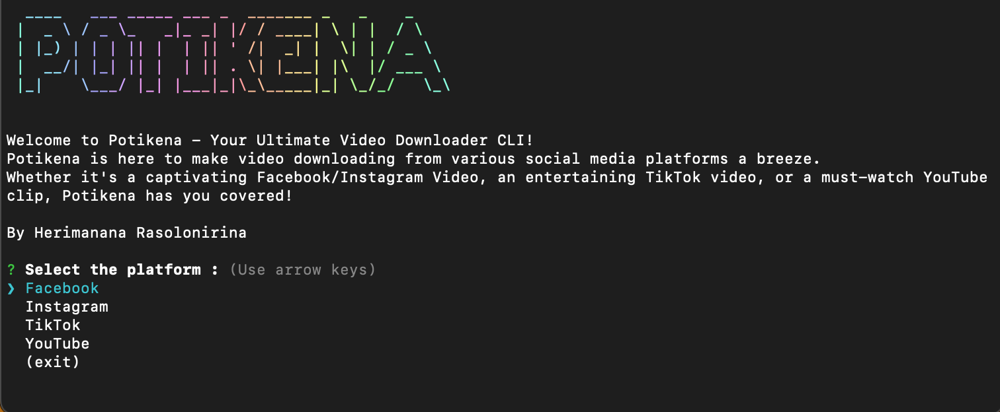

# Potikena - Your Ultimate Video Downloader CLI

Potikena is a simple command-line tool that allows you to easily download videos from various social media platforms. Whether it's a captivating Facebook/Instagram Video, an entertaining TikTok video, or a must-watch YouTube clip, Potikena has you covered!

💡<b>Note for YouTube: Due to restrictions on YouTube, use the URL obtained from the "Share" button on the video page, as the navigation bar link won't work.</b>💡



## Disclaimer
Potikena is an experimental tool and intended for personal use only, and the developer (Herimanana Rasolonirina) is not responsible for any misuse of the tool. Users are advised to use Potikena responsibly and comply with the terms of service of the respective platforms.

## Dependency

This tool owes its existence to the diligent efforts and dedication of the package's author --> [nayan-media-downloader](https://www.npmjs.com/package/nayan-media-downloader)

## Features

- Download videos from Facebook, Instagram, TikTok, YouTube, and more.

## Installation

Make sure you have [Node.js](https://nodejs.org/) installed on your machine.

In your prefered directory :
```bash
git clone git@github.com:herimanana301/Potikena-cli.git

```

```bash
npm install

```
To install it globally
```bash
npm install -g 

```
if you are on windows, please do this before installing it globally ( other case it will give error message )
```bash
Set-ExecutionPolicy -ExecutionPolicy RemoteSigned -Scope CurrentUser

```
*More information about Set-ExecutionPolicy of windows [here](https://learn.microsoft.com/en-us/powershell/module/microsoft.powershell.security/set-executionpolicy?view=powershell-7.4)
## Usage
Launch the tool using this command

```bash
potikena
```
To download a video, simply run the potikena command and follow the prompts:

- Choose the platform (facebook, instagram, tiktok or Youtube).
- Enter the URL of the video.
- Specify the path where you want to save the downloaded video.

Note for YouTube:
Due to restrictions on YouTube, use the URL obtained from the "Share" button on the video page, as the navigation bar link won't work.
